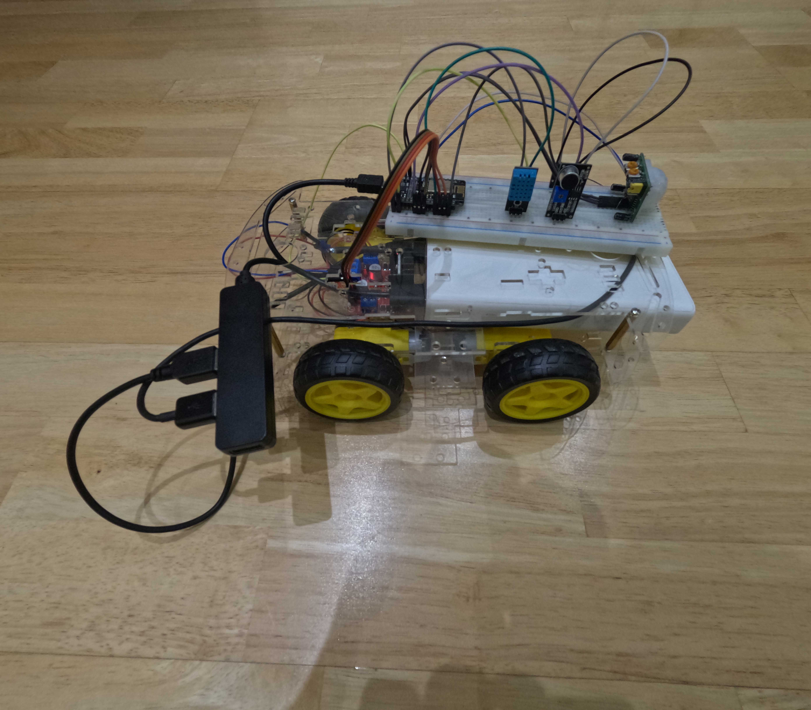
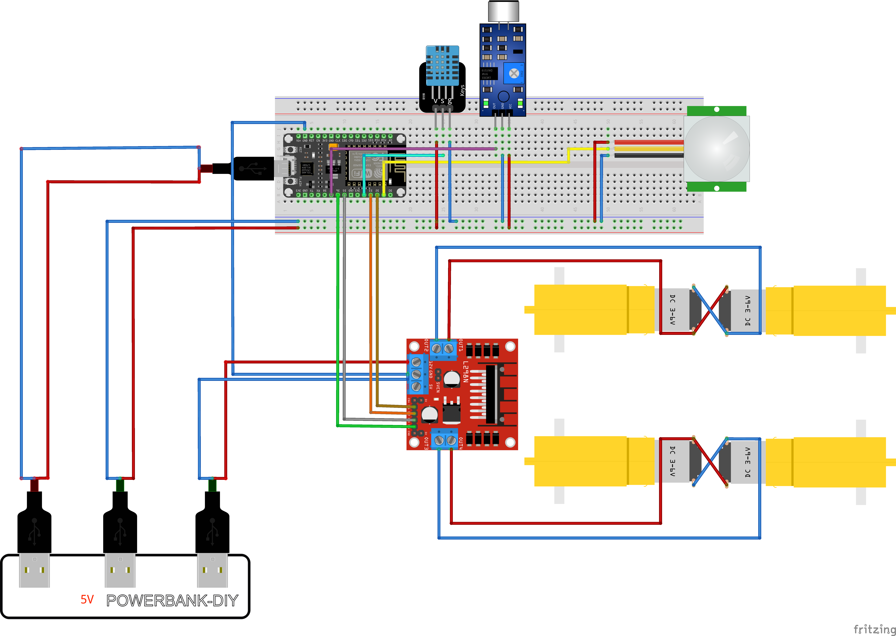
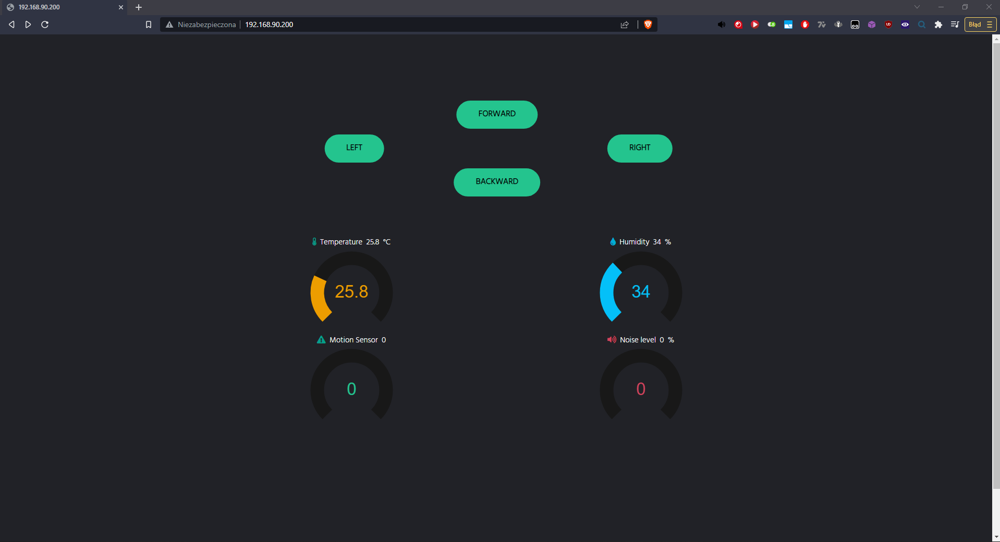

# ESP8266 WiFi Robot Car

13.02.2023 r.
Micro-controllers Programming
Created by [Mateusz Suszczyk](https://twitter.com/mateuszsuszczyk)
Watch the video demo! -> [link](https://www.youtube.com/watch?v=TINGj88mNsk)



## Description

The main purpose of my robot is to drive accordingly depending on what button will be clicked on a website accessible from PC/smartphone. In addition, the robot collects sensor data such as temperature, humidity, motion detection, and noise value.

## Components used

- NodeMCU v2 WiFi ESP8266
- Robot Chassis + tyres
- Motor Driver LN298N
- DHT 11 - temperature and humidity sensor
- Sound sensor
- HC-SR501 - PIR sensor
- 4 DC motors
- Breadboard
- Wires
- Powerbank 5V
- USB Hub

## Encountered problems

- Using a power bank as a source of power for motors is sufficient, but not optimal. To get better performance of motors, I highly encourage to use better source of power (e.g. 2x 18650 batteries).
- DHT11 tends to hang when reading values. To solve this problem try to reset the sensor by removing the cables and then putting it back.
- I had problems with .js file used to properly visualize knobs on site. Automatic refreshing values finally worked after one of those methods:
  - Putting .js on my GitHub and then reach file using cdn.jsdelivr.net -> [pureknob.js](https://cdn.jsdelivr.net/gh/suszczyk/ESP8266-WiFi-Robot@main/pureknob.js).
  - Uploading file on internal flash memory using `server.streamFile(file, contentType);`.

## Connections



## HTML website



## Setup

1. Clone repository.

2. After uploading code from `car.ino` to ESP8266 (remember to change the credentials of the wifi network), upload `index.html` to ESP using the command below:

```bash
curl -F "file=@index.html" x.x.x.x/upload
```

`x.x.x.x` is IP address of your ESP.

3. Make sure that javascript library is added. For more accurate sensor values I have changed `pureknob.js` line 635:

from

```javascript
value = Math.round(value);
```

to

```javascript
value = Math.round(value * 10) / 10;
```

If the website does not work properly, add this line at the beginning of `index.html`:
`<script src="https://cdn.jsdelivr.net/gh/suszczyk/ESP8266-WiFi-Robot-Car@main/pureknob.js"></script>` and rerun command from point 2.

4. Connect your phone to the same wifi network as your robot. After reaching `x.x.x.x` you should see the page above.

5. Happy driving :)

## Libraries

- [ESP8266WiFi](https://github.com/esp8266/Arduino/tree/master/libraries/ESP8266WiFi)
- [ESP8266WebServer](https://github.com/esp8266/Arduino/tree/master/libraries/ESP8266WebServer)
- [ESP8266WebServer](https://github.com/esp8266/Arduino/tree/master/libraries/ESP8266WebServer)
- [FS.h](https://github.com/esp8266/Arduino/blob/master/cores/esp8266/FS.h)
- [WebSocketsServer.h](https://github.com/Links2004/arduinoWebSockets)
- [ArduinoJson.h](https://github.com/bblanchon/ArduinoJson)

## Possible improvements

- Adding LCD screen
- Adding LM393 IR Speed sensor
- Connecting another ESP or Arduino to get more pins

## Worth mentioning

[datasith](https://www.youtube.com/@datasith) projects:

- [Robot Car Controlled Using Websockets](https://www.youtube.com/watch?v=4gl7IZLo7yA&t=275s&ab_channel=datasith)
- [ESP8266 Display JPEGs On NeoPixel Matrix - Store images on ESP8266](https://www.youtube.com/watch?v=u_C7robY118&t=523s&ab_channel=datasith)
- [ESP8266 Analog Voltages for Controlling Webpage RGB Colors](https://www.youtube.com/watch?v=kynSxSl0uKY&ab_channel=datasith)

Sensors:

- [Sound sensor](https://www.youtube.com/watch?v=PYkzJQhFNlA&ab_channel=BasonTech)
- [Sound sensor 2](https://arduino-tutorials.net/tutorial/drawing-sound-sensor-data-on-serial-plotter)
- [PIR sensor](https://randomnerdtutorials.com/arduino-with-pir-motion-sensor)

Other:
[ESP8266 and the Arduino IDE - IOT Website](http://www.martyncurrey.com/esp8266-and-the-arduino-ide-part-10c-iot-website-add-a-lcd/)
[Weather monitoring system using Blynk](https://www.youtube.com/watch?v=pOB8-pi796I&ab_channel=SriTuHobby)

UI:

- Dynamic bars: [pure-knob](https://github.com/andrepxx/pure-knob)
- Blynk colors palette: https://community.blynk.cc/uploads/default/original/2X/2/2d740375e05c5a79124e6d73c0da1c1b26802605.png
